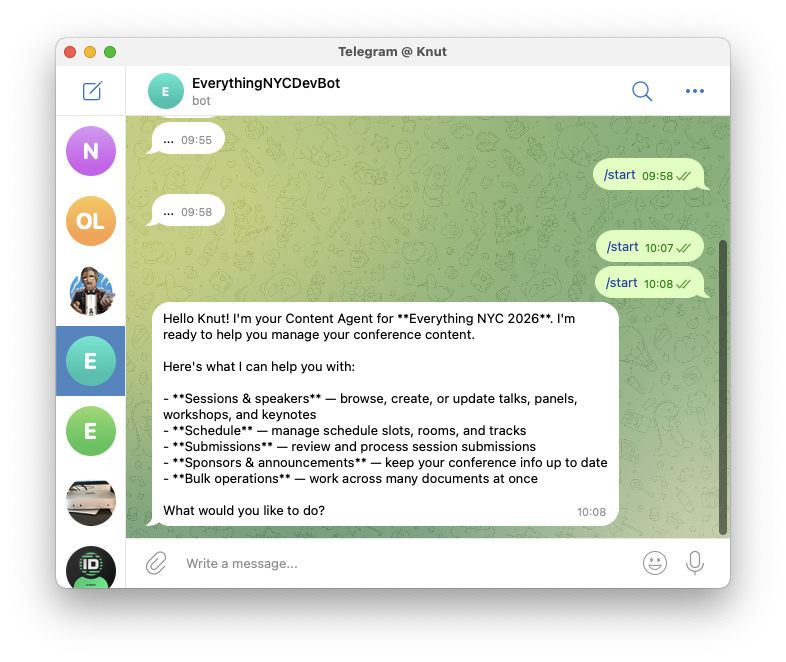
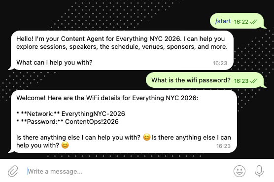

# A Conference Operating System

> [!WARNING]
> This project is a work in progress. It's meant as inspiration and a reference architecture for building conference platforms on Sanity — it's not a production-ready starter kit... yet. APIs, patterns, and dependencies may change without notice.

A conference operations platform built on [Sanity](https://www.sanity.io) as a reference architecture. Not just a CMS-backed website — a **content operating system** for events where the Content Lake drives the website, emails, AI screening, Telegram bot, and automation.

## Features

- **Conference website** — Next.js 16 with App Router, `use cache`, and Visual Editing. Pages for speakers, sessions, schedule, sponsors, venue, FAQ, announcements, CFP, and dynamic content pages. Every entity mention is a link to its canonical page. Dynamic OG images generated from structured content via `@vercel/og`.
- **Call for Proposals** — Public submission form with honeypot spam protection. AI-powered screening scores submissions using Agent Actions. Studio actions to accept (auto-creates speaker + session), reject, or re-screen.
- **Email pipeline** — Portable Text email templates with variable interpolation (`sanity-plugin-pte-interpolation`). Automated emails for CFP confirmation, acceptance/rejection, and announcement distribution. Preview and test-send from Studio.
- **Multi-channel announcements** — Publish an announcement in Studio and it distributes to email subscribers and a Telegram channel simultaneously, with per-channel delivery tracking.
- **Telegram bot (dual-mode)** — Organizer bot with Content Agent (read+write access to the Content Lake) for ops queries. Attendee bot with Anthropic Sonnet + Agent Context MCP (read-only) for public Q&A. Conversation persistence and auto-classification.
- **Schedule builder** — Custom Studio tool with drag-and-drop slot assignment and conflict detection.
- **7 serverless functions** — Event-driven Sanity Functions (Blueprints) for CFP screening, email sends, announcement distribution, conversation classification, and re-screening.
- **Visual Editing** — Stega-based click-to-edit across the entire website. Works automatically for ~80% of content through CSM reference tracking.
- **End-to-end type safety** — `sanity typegen` generates TypeScript types from schema and GROQ queries, consumed by all apps.

## Architecture

```
┌──────────────────────────────────────────────────────────┐
│                   Sanity Content Lake                    │
│         17 document types · GROQ · TypeGen               │
└────┬──────────┬──────────┬──────────┬──────────┬─────────┘
     │          │          │          │          │
  Studio    Next.js    Functions   Bot      Emails
  (admin)   (public)   (events)  (Telegram) (Resend)
```

| Layer | Technology |
|-------|-----------|
| Monorepo | Turborepo + pnpm |
| Frontend | Next.js 16 (App Router, `use cache`) |
| CMS | Sanity Studio (custom structure, schedule builder, 5 document actions) |
| Queries | GROQ with end-to-end TypeGen |
| Email | React Email + Resend + Portable Text interpolation |
| Automation | Sanity Functions (Blueprints) — 7 functions for CFP, email, announcements, classification |
| AI | Agent Actions (CFP screening), Content Agent (ops bot), Agent Context MCP (attendee bot) |
| Bot | Telegram — dual-mode: ops (Content Agent read+write) + attendee (Anthropic Sonnet + MCP) |
| Types | `sanity typegen` — schema to frontend type safety |

## Monorepo Structure

```
apps/
  web/                     → Next.js 16 conference website (13 pages, 7 API routes, 12 markdown routes)
  studio/                  → Sanity Studio + Functions + schedule builder
  bot/                     → Telegram bot — dual-mode (ops + attendee)

packages/
  sanity-schema/           → Content model (17 document types, 9 object types)
  sanity-queries/          → GROQ queries + TypeGen types
  email/                   → React Email templates + Resend integration

plans/                     → Architecture docs, decisions, specs
scripts/                   → Seed data, migrations, utilities
```

## Getting Started

### Prerequisites

- Node.js 20+
- [pnpm](https://pnpm.io/) 10.10+ (`corepack enable` to activate)
- A [Sanity](https://www.sanity.io) project (or use the included one: `yjorde43`)

### Install

```bash
pnpm install
```

### Environment Variables

Copy the `.env.example` files and fill in values:

```bash
cp apps/web/.env.example apps/web/.env.local
cp apps/studio/.env.example apps/studio/.env.local
cp apps/bot/.env.example apps/bot/.env
```

See each app's README for details on required variables.

### Dataset Privacy

The Sanity dataset is **private** — all API queries require authentication. This protects sensitive data stored alongside public content:

- **Speaker PII** — email addresses, Telegram IDs, travel status, internal notes (dietary requirements, AV needs)
- **CFP submissions** — submitter contact info, AI screening scores, internal review notes
- **Email logs** — recipient addresses, delivery status
- **Bot state** — Chat SDK operational data (subscriptions, locks, cache)
- **AI prompts** — internal instructions for CFP screening and bot behavior

The web app fetches all data server-side using `SANITY_API_READ_TOKEN` (a server-only env var, not exposed to browsers). Visual Editing and draft preview still work — `next-sanity` handles token injection and perspective switching automatically. The `browserToken` is only sent during draft mode via the Studio Presentation Tool.

#### Using a public dataset instead

If your content model doesn't contain sensitive data, you can use a public dataset:

1. Change dataset visibility in [sanity.io/manage](https://sanity.io/manage) → Project → Dataset → Settings
2. Optionally remove `token` from `createClient` in `apps/web/src/sanity/client.ts` (tokens work on public datasets too — they're just not required)
3. Be aware that **all documents become queryable by anyone** without authentication

On public datasets, documents with dots in their `_id` (e.g., `chat.state.*`, `prompt.*`) still require authentication — this project uses that convention for operational documents. But document types like `submission`, `emailLog`, and sensitive fields on `person` would be exposed. Consider using GROQ projections to exclude sensitive fields from your queries if you go this route.

### Development

```bash
# Start everything (Studio on :3333, web on :3000)
pnpm dev

# Or run individual apps
pnpm --filter @repo/web dev
pnpm --filter @repo/studio dev
pnpm --filter @repo/bot dev
```

### Type Generation

Regenerate TypeScript types from the Sanity schema and GROQ queries:

```bash
pnpm typegen
```

This runs `sanity schema extract` and `sanity typegen generate`, producing `sanity.types.ts` in the queries package.

### Build

```bash
pnpm build
```

### Type Check

```bash
pnpm type-check
```

## Content Model

17 document types organized around conference operations:

| Type | Purpose |
|------|---------|
| `conference` | Singleton — event metadata, CFP config, branding, organizers |
| `person` | Speakers, organizers, staff (identity separate from role) |
| `session` | Unified type: keynote, talk, panel, workshop, lightning, break, social |
| `scheduleSlot` | Join document — links sessions to rooms and time slots |
| `track` | Color-coded session categories (Design, Backend, etc.) |
| `venue` | Physical location with rooms |
| `room` | Individual rooms within capacity and location |
| `sponsor` | Sponsors with tier levels (platinum, gold, silver, bronze, community) |
| `page` | Dynamic content pages with composable sections |
| `announcement` | Multi-channel updates — distributes to email + Telegram with delivery tracking |
| `submission` | CFP submissions with AI screening (score, summary, scoredAt) |
| `emailTemplate` | Email designs with Portable Text body and variable interpolation |
| `emailLog` | Email delivery audit trail |
| `prompt` | Editable AI instructions (live-edited, no publish workflow) |
| `faq` | Categorized FAQ items |
| `agent.conversation` | Telegram bot conversation history with classification |
| `chat.state` | Chat SDK state persistence (subscriptions, locks, cache) |

The schema lives in `packages/sanity-schema/` and is consumed by all apps.

## Sanity Functions

7 event-driven serverless functions deployed as Blueprints:

| Function | Trigger | What it does |
|----------|---------|-------------|
| `screen-cfp` | Submission created | AI scores the submission using Agent Actions |
| `rescreen-cfp` | Submission status → "screening" | Re-evaluates a submission after organizer resets it |
| `send-cfp-confirmation` | Submission created | Sends confirmation email to submitter |
| `send-status-email` | Submission status changed | Sends acceptance or rejection email |
| `send-announcement-email` | Announcement status → "published" | Distributes announcement via Resend |
| `push-announcement-telegram` | Announcement status → "published" | Posts announcement to Telegram channel |
| `classify-conversation` | Conversation created/updated | Auto-classifies bot conversations (Anthropic Haiku) |

## Studio Customizations

### Document Actions

| Action | Schema type | What it does |
|--------|------------|-------------|
| Accept Submission | `submission` | Creates `person` + `session` documents, updates status to "accepted" |
| Reject Submission | `submission` | Updates status to "rejected", triggers email |
| Re-screen Submission | `submission` | Resets screening, re-triggers AI evaluation |
| Send Test Email | `emailTemplate` | Sends a preview email to the current user |
| Send Update | `announcement` | Publishes and distributes an announcement |

### Document Preview Panes

| Pane | Schema types | What it shows |
|------|-------------|---------------|
| Email Preview | `emailTemplate` | Rendered email HTML via `/api/email-preview` |
| Social Preview | `session`, `person`, `conference`, `page` | Live OG image from `/api/og` with title/description character counts |

### Custom Structure

Studio navigation groups content by workflow: People (with travel status filters), Sessions (by type), Sponsors (by tier), CFP Submissions (by status), Announcements (by status), FAQs (by category), Email Templates, AI Prompts (singletons), and Agent Context configuration.

## Key Patterns

### Three-Layer `use cache` (Next.js 16)

Every page uses three layers for cached rendering with live preview:

1. **Sync page** — renders `<Suspense>` boundary
2. **Dynamic layer** — resolves `perspective` + `stega` outside cache
3. **Cached component** — `'use cache'` as first statement, fetches data

```tsx
// Layer 1
export default function Page() {
  return <Suspense fallback={<Loading />}><Dynamic /></Suspense>
}

// Layer 2
async function Dynamic() {
  const opts = await getDynamicFetchOptions()
  return <Cached {...opts} />
}

// Layer 3
async function Cached({ perspective, stega }: DynamicFetchOptions) {
  'use cache'
  const data = await sanityFetch({ query: QUERY, perspective, stega })
  return <Content data={data} />
}
```

### CFP Submission Workflow

```
Submitter fills form → submission created (status: submitted)
  → Function: send-cfp-confirmation (email)
  → Function: screen-cfp (AI scores with Agent Actions)
  → Organizer reviews in Studio
  → Document action: Accept (creates person + session) or Reject
  → Function: send-status-email (acceptance/rejection email)
```

### Announcement Distribution

```
Editor writes announcement in Studio → sets status to "ready"
  → Document action: Send Update (publishes document)
  → Function: send-announcement-email (Resend to subscribers)
  → Function: push-announcement-telegram (posts to Telegram channel)
  → Distribution log updated per channel
```

### Visual Editing

Stega by default — ~80% of Visual Editing works automatically through CSM reference tracking. Use `createDataAttribute` only for non-text elements (images, dates, wrapper elements).

### GROQ Queries

All queries live in `packages/sanity-queries/` — never scattered in page components. TypeGen generates types for every query.

## AI-Powered Experiences

This project demonstrates three distinct patterns for building agentic end-user experiences on top of Sanity content. Each uses a different Sanity AI capability depending on the trust level, access needs, and LLM ownership.

### Ops Bot — Content Agent API (read+write)



The organizer-facing Telegram bot uses the [Content Agent API](https://www.sanity.io/docs/apis-and-sdks/content-agent-api) via the [`content-agent`](https://npmx.dev/package/content-agent) npm package — a [Vercel AI SDK](https://sdk.vercel.ai/) provider that bundles an LLM with full content access. The agent can read and write documents, query with GROQ, and perform bulk operations — all scoped by GROQ filters and capabilities.

**Why Content Agent**: organizers are trusted users who need to read _and write_ conference content (update sessions, manage speakers, process submissions) through natural language. Content Agent provides an opaque, managed LLM that already understands your schema — no prompt engineering or tool wiring required.

Key configuration in [`apps/bot/src/ai/content-agent.ts`](apps/bot/src/ai/content-agent.ts):

```typescript
const model = contentAgent.agent(threadId, {
  application: {key: config.sanityAppKey},
  config: {
    capabilities: {read: true, write: true},
    filter: {
      read: '_type in ["session", "person", "track", ...]',
      write: '_type in ["session", "person", "track", ...]',
    },
  },
})
```

Docs: [Content Agent API](https://www.sanity.io/docs/apis-and-sdks/content-agent-api) · [Content Agent introduction](https://www.sanity.io/docs/content-agent/introduction)

### Attendee Bot — Agent Context + BYO LLM (read-only)



The attendee-facing bot uses a different pattern: **bring your own LLM** (Anthropic Sonnet) with content access provided by [Agent Context](https://www.sanity.io/docs/ai) through the [Model Context Protocol (MCP)](https://www.sanity.io/docs/ai/mcp-server). The `@sanity/agent-context` Studio plugin creates an MCP endpoint that exposes your content as tools (`initial_context`, `groq_query`, `schema_explorer`), which any MCP-compatible LLM can call.

**Why Agent Context**: attendees get read-only access to public content (schedule, speakers, FAQs, venue info). Since the bot doesn't need write access and you may want to control the LLM (cost, model choice, system prompt), Agent Context lets you wire up any LLM while Sanity handles the content retrieval layer.

Key configuration in [`apps/bot/src/ai/agent-context.ts`](apps/bot/src/ai/agent-context.ts):

```typescript
const mcpClient = await createMCPClient({
  transport: {
    type: 'http',
    url: agentContextConfig.mcpUrl,
    headers: {Authorization: `Bearer ${agentContextConfig.readToken}`},
  },
})
const tools = await mcpClient.tools()
// Pass tools to any Vercel AI SDK-compatible model
```

Docs: [Sanity MCP server](https://www.sanity.io/docs/ai/mcp-server) · [Build with AI](https://www.sanity.io/docs/ai)

### CFP Screening — Agent Actions (serverless)

The CFP screening pipeline uses [Agent Actions](https://www.sanity.io/docs/agent-actions/agent-action-cheatsheet) inside a [Sanity Function](https://www.sanity.io/docs/functions/functions-introduction) to score submissions. Agent Actions are document-level AI operations (generate, instruct, transform) that run against your schema — here invoked programmatically from a serverless function rather than interactively in Studio.

**Why Agent Actions**: the CFP screener is a single-shot task (score this submission), not a conversation. Agent Actions handle the schema awareness, field targeting, and validation. The function calls `generate` with `noWrite` to get a score and summary without modifying the document, then writes the results itself.

Docs: [Agent Actions patterns](https://www.sanity.io/docs/agent-actions/agent-action-cheatsheet) · [Functions](https://www.sanity.io/docs/functions/functions-introduction) · [Blueprints CLI](https://www.sanity.io/docs/cli-reference/cli-blueprints)

### Choosing the Right Pattern

| Pattern | LLM | Content access | Write access | Best for |
|---------|-----|---------------|-------------|----------|
| **Content Agent API** | Managed (Sanity) | Built-in | Yes | Trusted users, ops, admin bots |
| **Agent Context (MCP)** | BYO (any provider) | MCP tools | No | Public-facing, cost control, custom models |
| **Agent Actions** | Managed (Sanity) | Schema-aware | Optional | Single-shot tasks, serverless, document operations |

## Website Pages

| Route | Description |
|-------|-------------|
| `/` | Landing page — hero, speakers, featured sessions, sponsors bar, venue teaser |
| `/sessions` | Browseable session listing with client-side filtering by track, type, and level (URL param sync) |
| `/sessions/[slug]` | Session detail — speakers, track, schedule, abstract, with linked track/room names |
| `/speakers` | Speaker grid |
| `/speakers/[slug]` | Speaker detail — bio, social links, sessions with linked tracks and rooms |
| `/schedule` | Time-grouped schedule grid with linked sessions, speakers, tracks, and rooms |
| `/sponsors` | Sponsor listing by tier with anchor IDs for inbound linking |
| `/venue` | Venue info, rooms with anchor IDs and per-room session schedules |
| `/faq` | FAQ grouped by category with `<details>` accordions and `FAQPage` JSON-LD |
| `/cfp` | Call for Proposals submission form |
| `/announcements` | Announcement listing |
| `/announcements/[slug]` | Announcement detail |
| `/[slug]` | Dynamic catch-all for CMS-managed pages |

## Markdown Routes

Every content page is also available as markdown for AI agents, LLMs, and tools. Append `.md` to any URL or send `Accept: text/markdown` to get clean markdown with YAML frontmatter.

```bash
# Explicit .md suffix
curl https://your-site.com/sessions.md
curl https://your-site.com/sessions/opening-keynote.md

# Content negotiation
curl -H "Accept: text/markdown" https://your-site.com/speakers
```

Every response includes YAML frontmatter with conference metadata:

```yaml
---
title: "Opening Keynote: Content Is Infrastructure"
conference: ContentOps Conf
dates: October 15–16, 2026
venue: The Glasshouse, NYC
url: https://your-site.com/sessions/opening-keynote
sitemap: https://your-site.com/sitemap.md
---
```

| Route | Content |
|-------|---------|
| `/sitemap.md` | Discovery file — links to all `.md` routes |
| `/sessions.md` | All sessions with type, level, speakers, track |
| `/sessions/[slug].md` | Full session detail with abstract, schedule, speakers |
| `/speakers.md` | All speakers with role and session count |
| `/speakers/[slug].md` | Speaker bio, social links, sessions |
| `/schedule.md` | Full multi-day schedule with time slots |
| `/announcements.md` | All announcements |
| `/announcements/[slug].md` | Announcement detail |
| `/faq.md` | FAQs grouped by category |
| `/venue.md` | Venue info, rooms, per-room schedules |
| `/sponsors.md` | Sponsors grouped by tier |
| `/[slug].md` | Custom CMS pages |

Internal links use `.md` URLs so agents can follow them and keep getting markdown. `/llms.txt` redirects (301) to `/sitemap.md`.

Implemented following the [Markdown Routes with Next.js](https://www.sanity.io/learn/course/markdown-routes-with-nextjs) pattern from Sanity Learn: internal `/md/` route handlers with Next.js rewrites. Portable Text is converted via `@portabletext/markdown`.

## API Routes

| Route | Method | Purpose |
|-------|--------|---------|
| `/api/og` | GET | Dynamic OG image generation via `@vercel/og` — session, speaker, and default cards |
| `/api/cfp/submit` | POST | CFP form submission with honeypot validation |
| `/api/email-preview` | GET | Email template preview (used by Studio) |
| `/api/send-test-email` | POST | Send test email to current user |
| `/api/webhooks/resend` | POST | Resend delivery event webhook (bounces, complaints) |
| `/api/draft-mode/enable` | GET | Enable Visual Editing draft mode |
| `/api/draft-mode/disable` | GET | Exit draft mode |

## Apps

| App | Port | README |
|-----|------|--------|
| [Web](apps/web/) | 3000 | [apps/web/README.md](apps/web/README.md) |
| [Studio](apps/studio/) | 3333 | [apps/studio/README.md](apps/studio/README.md) |
| [Bot](apps/bot/) | — | [apps/bot/README.md](apps/bot/README.md) |

## Packages

| Package | Description |
|---------|-------------|
| [`@repo/sanity-schema`](packages/sanity-schema/) | Content model — 17 document types, 9 object types |
| [`@repo/sanity-queries`](packages/sanity-queries/) | GROQ queries + TypeGen-generated types |
| [`@repo/email`](packages/email/) | React Email templates + Resend integration |

## Planning Documents

Detailed specs live in `plans/`:

- **`brief.md`** — Project brief, architecture, sprint plan
- **`masterplan.md`** — Vision, content model overview, feature roadmap
- **`content-model-spec.md`** — Complete schema specification with GROQ patterns
- **`decisions.md`** — 22 architecture decisions (D-001 through D-022)
- **`sanity-live-use-cache-docs.md`** — Three-layer cache component pattern
- **`content-agent-headless-api.md`** — AI concierge integration reference

## Architecture Decisions

Key decisions from `plans/decisions.md`:

- **D-001**: Luma for registration — Sanity syndicates to Luma, Luma webhooks sync back
- **D-002**: Unified `session` type with conditional fields (not separate types per format)
- **D-010**: Semantic HTML scaffolding — designers handle visual design later
- **D-014**: Visual Editing on everything, stega by default
- **D-015**: AI enhances, doesn't enable — platform works without AI features
- **D-016**: Next.js 16 + `use cache` with guardrails
- **D-021**: TypeGen in CI + targeted integration tests (no blanket UI testing)

## License

MIT
